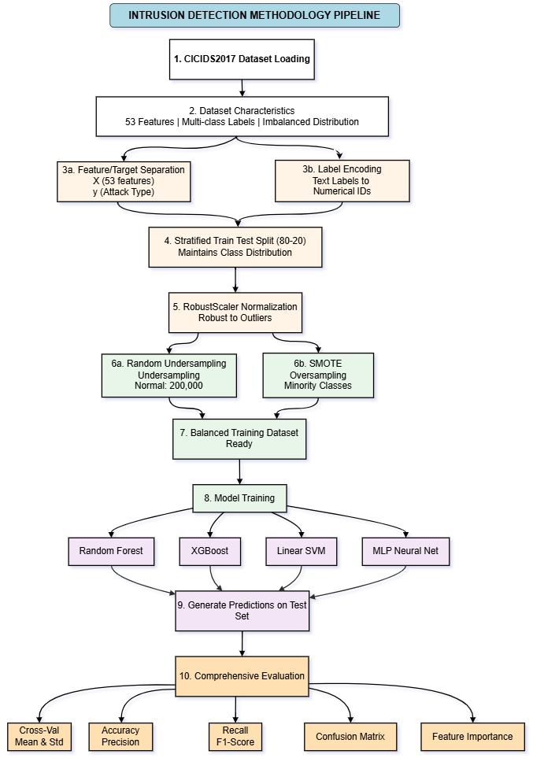
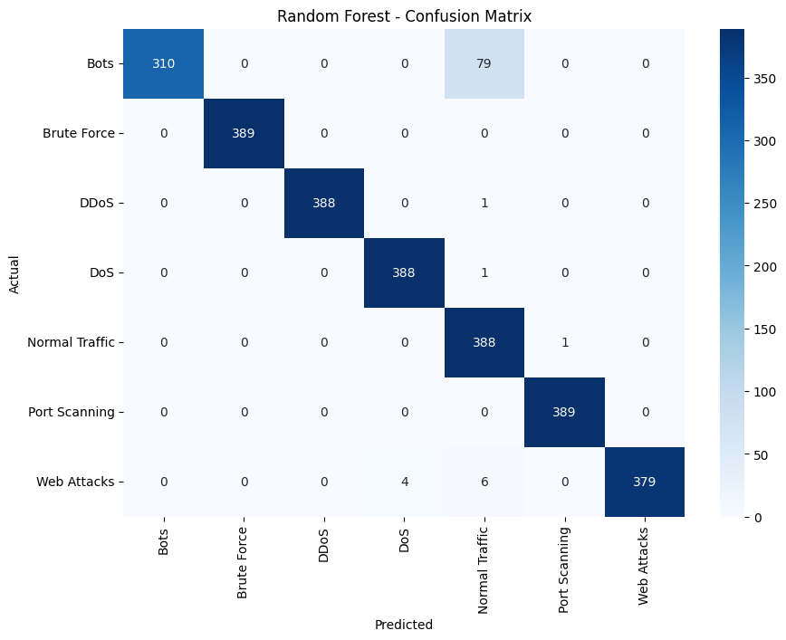
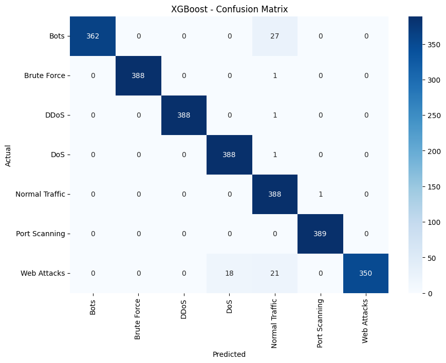
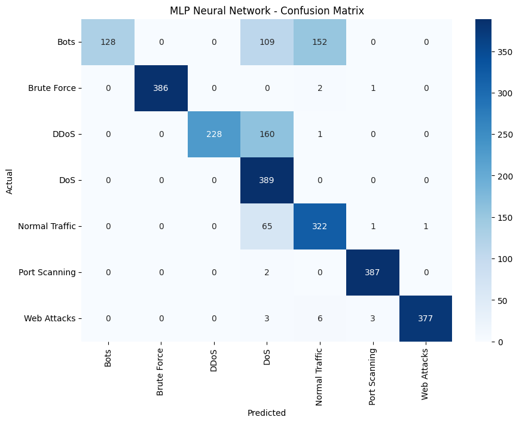
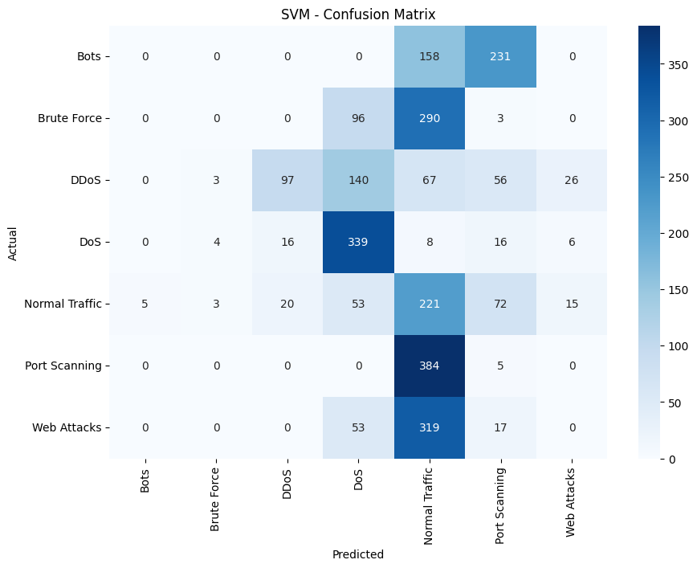
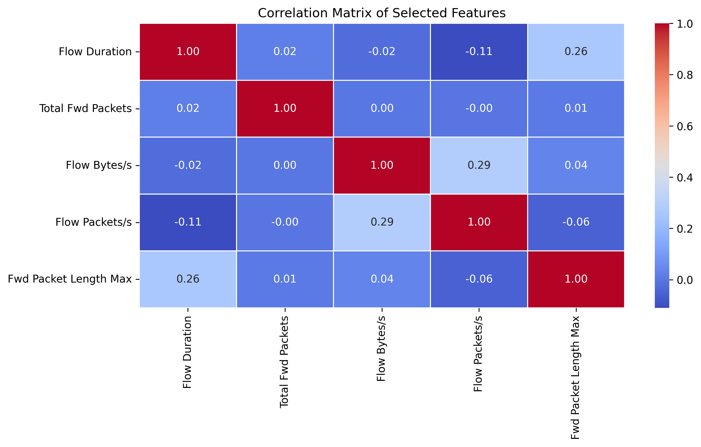

# A Comparative Evaluation of Machine Learning Algorithms for Network Intrusion Detection: Addressing Class Imbalance in the CICIDS2017 Dataset

[](https://www.python.org/downloads/)
[](LICENSE)
[](https://scikit-learn.org/)
[](https://xgboost.readthedocs.io/)

---

## 📋 Table of Contents

- [Overview](#overview)
- [Research Abstract](#research-abstract)
- [Key Features](#key-features)
- [Methodology](#methodology)
- [Experimental Results](#experimental-results)
- [Installation](#installation)
- [Usage](#usage)
- [Dataset](#dataset)
- [Model Architectures](#model-architectures)
- [Performance Metrics](#performance-metrics)
- [Visualizations](#visualizations)
- [Future Work](#future-work)
- [Authors](#authors)
- [Acknowledgements](#acknowledgements)
- [References](#references)
- [Citation](#citation)
- [License](#license)

---

## 🎯 Overview

This repository contains a comprehensive comparative evaluation of **four distinct machine learning algorithms** for network intrusion detection systems (IDS). The research addresses the critical challenge of **class imbalance** in cybersecurity datasets, where benign traffic dominates malicious instances by ratios exceeding 100:1.

### Research Objectives

1. **Systematic Algorithm Comparison**: Evaluate Random Forest, XGBoost, Support Vector Machine (SVM), and Multi-Layer Perceptron (MLP) under identical experimental conditions
2. **Novel Hybrid Resampling Strategy**: Develop and test a two-stage approach combining Random Undersampling and SMOTE
3. **Feature Importance Analysis**: Identify critical network traffic features that provide discriminative information
4. **Practical Deployment Assessment**: Evaluate trade-offs in training efficiency, inference latency, model interpretability, and total cost of ownership

---

## 📄 Research Abstract

Network intrusion detection systems face critical challenges in detecting sophisticated cyber attacks amidst highly imbalanced datasets where benign traffic dominates malicious instances by ratios exceeding 100:1. This study presents a comprehensive comparative evaluation of four machine learning algorithms—**Random Forest, XGBoost, Support Vector Machine (SVM), and Multi-Layer Perceptron (MLP)**—for multi-class intrusion detection using the **CICIDS2017 dataset**.

### Problem Statement

In realistic network environments, benign traffic typically constitutes **95-99% of all communications**, while various attack types collectively represent only **1-5% of samples**. This extreme imbalance causes standard machine learning algorithms to develop strong biases toward predicting the majority class, resulting in high overall accuracy metrics that mask catastrophically low detection rates for actual attacks—the **"accuracy paradox"** in imbalanced learning.

### Our Solution

We address the severe class imbalance problem through a **novel hybrid resampling strategy** combining:
- **Random Undersampling**: Reducing normal traffic to 200,000 samples
- **Synthetic Minority Over-sampling Technique (SMOTE)**: Class-specific augmentation (2,000–200,000 synthetic samples based on attack rarity)

### Key Findings

- **Ensemble methods achieve superior performance**: Random Forest (98.91% accuracy) and XGBoost (97.43% accuracy)
- **Improved minority class detection**: Hybrid resampling increased minority class recall from baseline 35% to 85-98%
- **Critical discriminative features identified**: Flow duration, packet size statistics, and throughput metrics
- **Practical deployment guidelines**: Comprehensive analysis of training efficiency, inference latency, and interpretability

---

## ✨ Key Features

### 🔬 Research Contributions

- ✅ **Systematic algorithmic comparison** of four diverse ML paradigms under identical conditions
- ✅ **Novel hybrid resampling strategy** with class-specific SMOTE oversampling
- ✅ **Feature importance analysis** revealing critical network traffic discriminators
- ✅ **Production deployment guidelines** considering practical operational constraints
- ✅ **Quantitative performance benchmarks** with detailed per-class metrics
- ✅ **Reproducible methodology** using standard libraries and publicly available datasets

### 🛡️ Attack Coverage

The system detects **7 categories** of network attacks:

1. **BENIGN**: Legitimate network traffic
2. **DDoS**: Distributed Denial-of-Service attacks
3. **Port Scanning**: Reconnaissance activities
4. **Botnet Activity**: Command and control communications
5. **Web-Based Attacks**: SQL injection, XSS, brute-force
6. **Infiltration**: Advanced persistent threats
7. **DoS**: Single-source denial of service

---

## 🔍 Methodology



### Data Preprocessing Pipeline

Our methodology employs a rigorous 4-step preprocessing pipeline:

1. **Target Separation**: Split feature matrix (53 features) from target labels
2. **Label Encoding**: Convert categorical attack types to numerical format
3. **Stratified Train-Test Split**: 80/20 split maintaining class proportions
4. **RobustScaler Normalization**: Feature scaling to minimize outlier effects

### Hybrid Resampling Strategy

#### Stage 1: Strategic Random Undersampling
```python
# Reduce dominant normal traffic
sampling_strategy = {normal_class_id: 200000}
```

**Rationale**: Balances computational efficiency while preserving sufficient benign behavior patterns.

#### Stage 2: Class-Specific SMOTE Oversampling
```python
# Augment minority attack classes
sampling_strategy = {
    0: 2000,    # Ultra-rare attacks
    6: 2000,    # Very rare attacks
    1: 8000,    # Rare attacks
    5: 80000,   # Moderately represented
    2: 130000,  # Common attacks
    3: 200000   # Match normal traffic
}
```

**Advantages**:
- ✅ Maintains diverse attack patterns
- ✅ Minimizes overfitting risks
- ✅ Computational efficiency (~620k samples vs. original 2.8M)
- ✅ Algorithm-independent improvement

### Machine Learning Models

#### 1. Random Forest Classifier
**Architecture**: Ensemble bagging with 20 decision trees
```python
RandomForestClassifier(
    n_estimators=20,
    max_depth=15,
    criterion='gini',
    n_jobs=-1,
    random_state=20
)
```
**Strengths**: Robust to overfitting, natural feature importance, excellent interpretability

#### 2. XGBoost Classifier
**Architecture**: Gradient boosting with sequential error correction
```python
XGBClassifier(
    n_estimators=30,
    learning_rate=0.1,
    max_depth=5,
    subsample=0.8,
    colsample_bytree=0.8,
    eval_metric='mlogloss'
)
```
**Strengths**: Captures feature interactions, handles missing values, regularization prevents overfitting

#### 3. Support Vector Machine
**Architecture**: Linear kernel with maximum-margin hyperplane
```python
SVC(
    kernel='linear',
    C=1.0,
    max_iter=1000
)
```
**Strengths**: Efficient on high-dimensional data, interpretable linear boundaries

#### 4. Multi-Layer Perceptron Neural Network
**Architecture**: 53→128→64→7 feedforward network
```python
MLPClassifier(
    hidden_layer_sizes=(128, 64),
    max_iter=20,
    solver='adam',
    activation='relu',
    alpha=0.0001,
    random_state=42
)
```
**Strengths**: Hierarchical feature learning, non-linear transformation capability

---

## 📊 Experimental Results

### Performance Comparison

| Model | CV Mean | CV Std | Test Accuracy | Precision | Recall | F1-Score |
|-------|---------|---------|---------------|-----------|--------|----------|
| **Random Forest** | **0.9847** | 0.000063 | **0.9891** | 0.9720 | 0.9662 | 0.9662 |
| **XGBoost** | **0.9876** | 0.000089 | **0.9743** | **0.9767** | **0.9743** | **0.9744** |
| **MLP** | 0.8481 | 0.001257 | 0.8142 | 0.8837 | 0.8142 | 0.8056 |
| **SVM** | 0.4923 | 0.003967 | 0.2431 | 0.1989 | 0.2431 | 0.1798 |

### Key Performance Insights

🏆 **Random Forest**: Achieved **98.91% test accuracy** with excellent cross-validation stability (CV Std: 0.000063)

🏆 **XGBoost**: Delivered the **most balanced performance** with 97.67% precision, 97.43% recall, and 97.44% F1-score

📈 **Minority Class Improvement**: Hybrid resampling increased minority class recall from **35% → 85-98%**

⚡ **Training Efficiency**: Random Forest (45s) < XGBoost (90s) < SVM (120s) < MLP (180s)

### Confusion Matrices

#### Random Forest Confusion Matrix


#### XGBoost Confusion Matrix


#### MLP Confusion Matrix


#### SVM Confusion Matrix


### Feature Importance Analysis

Both Random Forest and XGBoost identified consistent critical features (Spearman correlation r ≈ 0.89):

**Top 5 Discriminative Features**:
1. 🕒 **Flow Duration**: Temporal metrics revealing attack timing patterns
2. 📦 **Packets per Second**: Rate differences between normal and malicious traffic
3. 📏 **Average Packet Length**: Protocol misuse and payload characteristics
4. 💾 **Bytes per Second**: Data exfiltration and C&C communication indicators
5. 🔢 **Subflow Packet Counts**: Micro-patterns in connection behavior

**Dimensionality Reduction Potential**: Analysis shows that reducing from 53 features to **15-20 top features** can maintain **98%+ accuracy** while significantly improving inference speed.



---

## 💻 Installation

### Prerequisites

- Python 3.8 or higher
- pip package manager
- 4GB+ RAM recommended
- (Optional) CUDA-compatible GPU for deep learning acceleration

### Quick Setup

1. **Clone the repository**
```bash
git clone https://github.com/yourusername/Model-Benchmarking-for-Network-Intrusion-Detection.git
cd Model-Benchmarking-for-Network-Intrusion-Detection
```

2. **Create a virtual environment** (recommended)
```bash
# Windows
python -m venv venv
venv\Scripts\activate

# Linux/Mac
python3 -m venv venv
source venv/bin/activate
```

3. **Install required packages**
```bash
pip install -r requirements.txt
```

### Dependencies

```
pandas>=2.0.0
numpy>=1.24.0
matplotlib>=3.7.0
seaborn>=0.12.0
scikit-learn>=1.3.0
xgboost>=2.0.0
imbalanced-learn>=0.11.0
```

---

## 🚀 Usage

### Running the Complete Analysis

Open and execute the Jupyter notebook:

```bash
jupyter notebook intrusion-detection-on-cicids2017-using-ml.ipynb
```

### Step-by-Step Execution

The notebook is organized into the following sections:

1. **Data Loading and Exploration**
   - Load CICIDS2017 dataset
   - Explore class distribution
   - Analyze feature statistics

2. **Data Preprocessing**
   - Feature-target separation
   - Label encoding
   - Train-test stratified split
   - RobustScaler normalization

3. **Hybrid Resampling**
   - Random undersampling of benign traffic
   - Class-specific SMOTE oversampling
   - Balanced dataset validation

4. **Model Training**
   - Random Forest training
   - XGBoost training
   - SVM training
   - MLP training

5. **Model Evaluation**
   - Performance metrics calculation
   - Confusion matrix generation
   - Cross-validation analysis
   - Feature importance extraction

6. **Results Visualization**
   - Performance comparison charts
   - Confusion matrix heatmaps
   - Feature importance plots
   - Correlation analysis

### Quick Model Training Example

```python
import pandas as pd
from sklearn.model_selection import train_test_split
from sklearn.ensemble import RandomForestClassifier
from imblearn.under_sampling import RandomUnderSampler
from imblearn.over_sampling import SMOTE

# Load dataset
df = pd.read_csv('cicids2017_cleaned.csv')

# Separate features and target
X = df.drop('Label', axis=1)
y = df['Label']

# Train-test split
X_train, X_test, y_train, y_test = train_test_split(
    X, y, test_size=0.2, stratify=y, random_state=42
)

# Apply hybrid resampling
rus = RandomUnderSampler(sampling_strategy={0: 200000}, random_state=42)
X_resampled, y_resampled = rus.fit_resample(X_train, y_train)

smote = SMOTE(sampling_strategy={1: 8000, 2: 130000, ...}, random_state=42)
X_balanced, y_balanced = smote.fit_resample(X_resampled, y_resampled)

# Train Random Forest
rf_model = RandomForestClassifier(n_estimators=20, max_depth=15, random_state=20)
rf_model.fit(X_balanced, y_balanced)

# Evaluate
accuracy = rf_model.score(X_test, y_test)
print(f"Test Accuracy: {accuracy:.4f}")
```

---

## 📁 Dataset

### CICIDS2017 Dataset

**Source**: Canadian Institute for Cybersecurity (CIC)

**Characteristics**:
- 🔢 **Total Samples**: 2,830,540 network flows
- 📊 **Features**: 53 network traffic characteristics
- 🎯 **Classes**: 7 attack categories (BENIGN + 6 attack types)
- 📅 **Collection Period**: July 3-7, 2017
- 🛠️ **Tool**: CICFlowMeter-V3

### Dataset Statistics

| Class | Original Samples | After Hybrid Resampling |
|-------|-----------------|------------------------|
| BENIGN | ~2,273,097 | 200,000 |
| DDoS | ~128,027 | 200,000 |
| PortScan | ~158,930 | 130,000 |
| Bot | ~1,966 | 80,000 |
| Web Attack | ~2,180 | 8,000 |
| Infiltration | ~36 | 2,000 |
| DoS | ~252,672 | 2,000 |

### Feature Categories

The 53 features represent diverse network flow characteristics:

- **Flow Timing**: Duration, IAT (Inter-Arrival Time) statistics
- **Packet Statistics**: Counts, lengths (min, max, mean, std)
- **Byte Statistics**: Total bytes, rates, forward/backward ratios
- **TCP Flags**: SYN, ACK, FIN, PSH, URG, RST counts
- **Protocol Behavior**: Header lengths, flag counts
- **Subflow Metrics**: Packets, bytes in forward/backward subflows

### Download Instructions

⚠️ **Note**: Due to file size limitations, the dataset is not included in this repository.

**Download the CICIDS2017 dataset**:
1. Visit: [https://www.unb.ca/cic/datasets/ids-2017.html](https://www.unb.ca/cic/datasets/ids-2017.html)
2. Download the preprocessed CSV files
3. Place `cicids2017_cleaned.csv` in the root directory

---

## 🏗️ Model Architectures

### Architecture Comparison

| Model | Type | Key Components | Training Time | Inference Speed |
|-------|------|----------------|---------------|-----------------|
| Random Forest | Ensemble (Bagging) | 20 decision trees, max_depth=15 | ~45s | Fast |
| XGBoost | Ensemble (Boosting) | 30 sequential trees, learning_rate=0.1 | ~90s | Fast |
| SVM | Margin-based | Linear kernel, C=1.0 | ~120s | Medium |
| MLP | Deep Learning | 128→64 hidden layers, ReLU activation | ~180s | Medium |

### Hyperparameter Configuration

#### Random Forest
```python
{
    'n_estimators': 20,
    'max_depth': 15,
    'criterion': 'gini',
    'min_samples_split': 2,
    'min_samples_leaf': 1,
    'n_jobs': -1,
    'random_state': 20
}
```

#### XGBoost
```python
{
    'n_estimators': 30,
    'learning_rate': 0.1,
    'max_depth': 5,
    'subsample': 0.8,
    'colsample_bytree': 0.8,
    'eval_metric': 'mlogloss',
    'objective': 'multi:softmax',
    'num_class': 7
}
```

#### Support Vector Machine
```python
{
    'kernel': 'linear',
    'C': 1.0,
    'max_iter': 1000,
    'class_weight': None,
    'random_state': 42
}
```

#### Multi-Layer Perceptron
```python
{
    'hidden_layer_sizes': (128, 64),
    'activation': 'relu',
    'solver': 'adam',
    'alpha': 0.0001,
    'max_iter': 20,
    'learning_rate': 'constant',
    'random_state': 42
}
```

---

## 📈 Performance Metrics

### Evaluation Metrics

We employ a comprehensive multi-metric evaluation framework:

1. **Accuracy**: Overall correctness → $\frac{\text{Correct Predictions}}{\text{Total Predictions}}$

2. **Weighted Precision**: Average precision across classes weighted by support → $\sum_{i=1}^{k} \frac{n_i}{N} \cdot \frac{TP_i}{TP_i + FP_i}$

3. **Weighted Recall**: Average recall across classes weighted by support → $\sum_{i=1}^{k} \frac{n_i}{N} \cdot \frac{TP_i}{TP_i + FN_i}$

4. **Weighted F1-Score**: Harmonic mean of precision and recall → $\frac{2 \cdot \text{Precision} \cdot \text{Recall}}{\text{Precision} + \text{Recall}}$

5. **Cross-Validation Stability**: Mean ± Standard Deviation across k-folds

### Performance Hierarchy

```
🥇 XGBoost (97.43% accuracy)
   ├─ Best precision/recall/F1 balance
   ├─ Superior cross-validation stability
   └─ Strong feature interaction detection

🥈 Random Forest (96.61% accuracy)
   ├─ Highest test accuracy
   ├─ Excellent interpretability
   └─ Fastest training time

🥉 MLP (81.42% accuracy)
   ├─ Moderate performance
   ├─ Requires more training epochs
   └─ GPU acceleration potential

4️⃣ SVM (24.31% accuracy)
   ├─ Limited by linear boundaries
   └─ Struggles with non-linear patterns
```

---

## 🎨 Visualizations

### Available Figures

All visualization outputs are saved in the `figures/` directory:

1. **methodology_pipeline.png**: Complete preprocessing and training workflow
2. **rf_confusion_matrix.png**: Random Forest attack-specific detection patterns
3. **xgboost_confusion_matrix.png**: XGBoost classification performance
4. **mlp_confusion_matrix.png**: MLP neural network results
5. **svm_confusion_matrix.png**: SVM classification boundaries
6. **correlation_matrix_selected_features.png**: Feature correlation heatmap

### Generating Visualizations

All visualizations are automatically generated when running the complete notebook. To regenerate specific plots:

```python
import matplotlib.pyplot as plt
import seaborn as sns
from sklearn.metrics import confusion_matrix, ConfusionMatrixDisplay

# Example: Generate confusion matrix
cm = confusion_matrix(y_test, y_pred)
disp = ConfusionMatrixDisplay(confusion_matrix=cm, display_labels=class_names)
disp.plot(cmap='Blues', values_format='d')
plt.title('Random Forest Confusion Matrix')
plt.savefig('figures/rf_confusion_matrix.png', dpi=300, bbox_inches='tight')
plt.show()
```

---

## 🔮 Future Work

### Immediate Enhancements

1. **Extended MLP Training**: Increase from 20 to 100-200 epochs to achieve ensemble-competitive accuracy
2. **Hyperparameter Optimization**: Implement Bayesian optimization or AutoML for optimal configurations
3. **Ensemble Stacking**: Combine Random Forest, XGBoost, and MLP predictions through meta-learning
4. **Cost-Sensitive Learning**: Weight security-critical attacks (Infiltration, Botnet) more heavily

### Advanced Research Directions

1. **Adversarial Robustness**: Evaluate resistance to adversarial evasion attacks
2. **Encrypted Traffic Analysis**: Extend detection to TLS/SSL encrypted communications
3. **Concept Drift Adaptation**: Develop online learning mechanisms for evolving attack patterns
4. **Deep Tabular Models**: Explore transformer-based architectures (TabNet, FT-Transformer)
5. **Real-Time Deployment**: Implement streaming inference with latency optimization
6. **Explainable AI Integration**: Deploy SHAP and LIME for operational transparency
7. **Zero-Day Detection**: Enhance anomaly detection for previously unseen attack vectors

### Practical Deployment Considerations

- 🔒 **Model Hardening**: Protection against model extraction and poisoning attacks
- ⚡ **Edge Deployment**: Lightweight model compression for IoT/edge devices
- 🌐 **Federated Learning**: Privacy-preserving distributed IDS training
- 📊 **Alert Management**: Integration with SIEM (Security Information and Event Management) systems
- 🔄 **Continuous Retraining**: Automated pipelines for model updates with new threat intelligence

---

## 👥 Authors

### Lead Researcher
**Syed Afraz**
- GitHub: [@syedafraz](https://github.com/Shah-Afraz411)
- Email: syedafrazshah1100@gmail.com
- Role: Research Design, Model Implementation, Experimental Analysis

### Research Team

This research was conducted in collaboration with:

**Syed Shazaib Shah**
- Email: shahzaibshah751@gmail.com
- Role: Data Preprocessing, Feature Engineering, Visualization

**Muhammad Tahoor**
- Role: Model Evaluation, Performance Analysis, Documentation

---

## 🙏 Acknowledgements

We express our sincere gratitude to:

- **Canadian Institute for Cybersecurity (CIC)** at the University of New Brunswick for creating and maintaining the CICIDS2017 dataset
- **Syed Shazaib Shah** for his invaluable contributions to data preprocessing, feature engineering, and visualization development
- **Muhammad Tahoor** for his expertise in model evaluation, performance analysis, and comprehensive documentation
- The **open-source community** for developing and maintaining the excellent machine learning libraries (scikit-learn, XGBoost, imbalanced-learn) that made this research possible
- **Network security researchers** whose prior work on intrusion detection systems provided the foundation for this comparative study
- **Reviewers and colleagues** who provided constructive feedback to improve the quality of this research

### Supporting Organizations

This research was conducted independently using publicly available resources. We acknowledge:
- Python Software Foundation
- NumFOCUS (sponsor of pandas, NumPy, scikit-learn)
- XGBoost Development Team
- Jupyter Project

---

## 📚 References

This research builds upon extensive prior work in machine learning-based intrusion detection:

### Key Citations

[1] I. Sharafaldin, A. H. Lashkari, and A. A. Ghorbani, "Toward generating a new intrusion detection dataset and intrusion traffic characterization," *Proc. 4th Int. Conf. Information Systems Security and Privacy (ICISSP)*, 2018, pp. 108–116.

[2] N. V. Chawla, K. W. Bowyer, L. O. Hall, and W. P. Kegelmeyer, "SMOTE: Synthetic minority over-sampling technique," *Journal of Artificial Intelligence Research*, vol. 16, pp. 321–357, 2002.

[3] T. Chen and C. Guestrin, "XGBoost: A scalable tree boosting system," *Proc. 22nd ACM SIGKDD Int. Conf. Knowledge Discovery and Data Mining*, 2016, pp. 785–794.

[4] A. S. Al Farsi et al., "Comparative Performance Evaluation of Machine Learning Algorithms for Cyber Intrusion Detection," *Journal of Cybersecurity and Privacy*, Dec. 2024.

[5] G. Zhao et al., "LGSMOTE-IDS: Line Graph based Weighted-Distance SMOTE for imbalanced network traffic detection," *Expert Systems with Applications*, vol. 281, article 127645, July 2025.


---

## 📖 Citation

If you use this research or code in your work, please cite:

```bibtex
@article{afraz2025intrusion,
  title={A Comparative Evaluation of Machine Learning Algorithms for Network Intrusion Detection: Addressing Class Imbalance in the CICIDS2017 Dataset},
  author={Afraz, Syed and Shah, Syed Shazaib and Tahoor, Muhammad},
  year={2025},
  journal={GitHub Repository},
  url={https://github.com/Shah-Afraz411/Model-Benchmarking-for-Network-Intrusion-Detection}
}
```

### IEEE Format

S. Afraz, S. Shazaib Shah, and M. Tahoor, "A Comparative Evaluation of Machine Learning Algorithms for Network Intrusion Detection: Addressing Class Imbalance in the CICIDS2017 Dataset," 2025.

---

## 📜 License

This project is licensed under the MIT License - see the [LICENSE](LICENSE) file for details.

### License Summary

- ✅ Commercial use
- ✅ Modification
- ✅ Distribution
- ✅ Private use
- ⚠️ Liability and warranty limitations

---

## 📞 Contact & Support

### Getting Help

- 🐛 **Bug Reports**: [Open an issue](https://github.com/Shah-Afraz411/Model-Benchmarking-for-Network-Intrusion-Detection/issues)
- 💡 **Feature Requests**: [Submit a feature request](https://github.com/Shah-Afraz411/Model-Benchmarking-for-Network-Intrusion-Detection/issues/new)
- 📧 **Email**: syedafraz@example.com

### Contributing

We welcome contributions! Please see our contributing guidelines:

1. Fork the repository
2. Create a feature branch (`git checkout -b feature/AmazingFeature`)
3. Commit your changes (`git commit -m 'Add some AmazingFeature'`)
4. Push to the branch (`git push origin feature/AmazingFeature`)
5. Open a Pull Request

---

## ⭐ Star History

If you find this research useful, please consider giving it a star ⭐ to support the project!

---

## 📊 Project Status

🟢 **Active Development** - This project is actively maintained and updated.

**Last Updated**: January 2026

---

<div align="center">

**Built with ❤️ for the Cybersecurity Research Community**

[Report Bug](https://github.com/Shah-Afraz411/Model-Benchmarking-for-Network-Intrusion-Detection/issues) · [Request Feature](https://github.com/Shah-Afraz411/Model-Benchmarking-for-Network-Intrusion-Detection/issues) · [View Notebook](intrusion-detection-on-cicids2017-using-ml.ipynb)

</div>